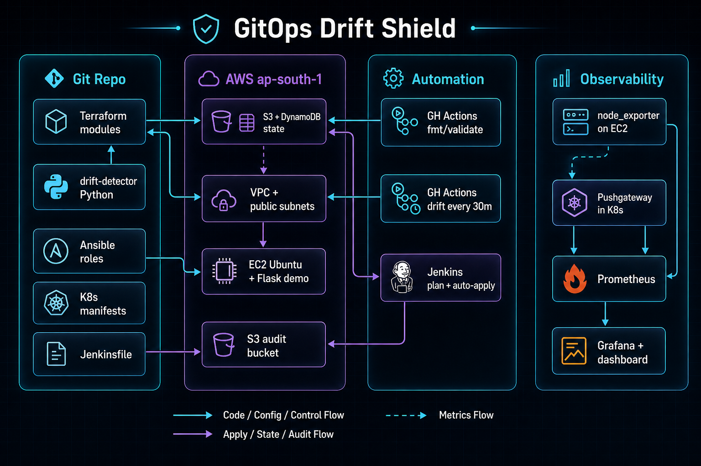
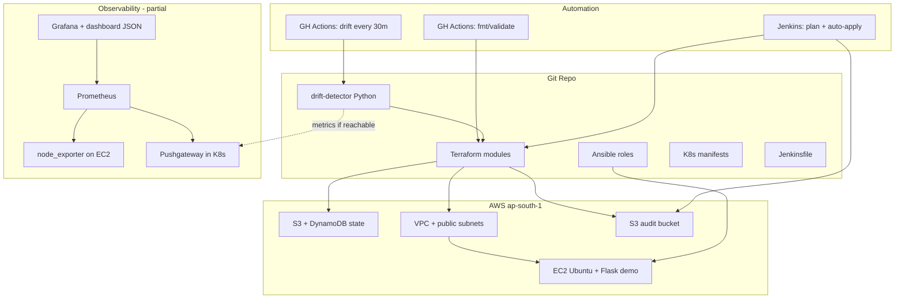

<h1 align="center">GitOps Drift Shield</h1>

<p align="center">
  <strong>Built an automated, closed-loop SRE pipeline that detects manual AWS changes, alerts the engineering team, automatically remediates the drift, and securely logs the incident for compliance auditing.</strong>
</p>

<p align="center">
  <a href="https://github.com/prashant-zo/gitops-drift-shield"></a>
  <a href="https://github.com/prashant-zo/gitops-drift-shield"></a>
  <a href="https://github.com/prashant-zo/gitops-drift-shield"></a>
  <a href="https://github.com/prashant-zo/gitops-drift-shield"></a>
</p>

<p align="center">
  <a href="#-demo-video">Demo</a> ·
  <a href="#-architecture">Architecture</a> ·
  <a href="#-what-this-project-does">Features</a> ·
  <a href="#-repository-layout">Layout</a> ·
  <a href="#-prerequisites">Prerequisites</a> ·
  <a href="#-quick-start">Quick Start</a> ·
  <a href="#-drift-detection">Drift Detection</a> ·
  <a href="#-cicd--automation">CI/CD</a> ·
  <a href="#-observability">Observability</a> ·
  <a href="#-known-limitations">Limitations</a>
</p>

---

## Demo video

> **Loom walkthrough (coming soon)** — replace the placeholder below when your video is ready.

<!-- Replace LOOM_URL with your share link, e.g. https://www.loom.com/share/xxxxxxxx -->

<p align="center">
  <a href="LOOM_URL">
    
  </a>
</p>

---

## Overview

**GitOps Drift Shield** is a hands-on DevOps lab project that keeps AWS infrastructure defined in **Terraform** aligned with reality. When someone changes resources outside Terraform (console, CLI, or manual edits), the project:

1. **Detects** drift via `terraform plan -detailed-exitcode` (locally, on a schedule in GitHub Actions, or in Jenkins).
2. **Notifies** via Slack and **metrics** via Prometheus Pushgateway (when reachable).
3. **Remediates** optionally through a Jenkins pipeline that applies the saved plan and writes a JSON audit entry to S3.

Configuration management on EC2 (demo Flask app + node_exporter) is handled with **Ansible**. A **Kubernetes** `monitoring` namespace runs Prometheus, Grafana, Pushgateway, and an optional Jenkins agent image for local/kind-style setups.

| Layer | Technology in this repo |
|--------|-------------------------|
| Infrastructure | Terraform `>= 1.5.0`, AWS provider `~> 5.0` |
| Config management | Ansible roles: `common`, `monitoring`, `app` |
| Drift tooling | Python 3 (`drift-detector/`) |
| CI | GitHub Actions (validate + scheduled drift) |
| Remediation | Jenkins (`jenkins/Jenkinsfile`) |
| Observability | Prometheus, Grafana, Pushgateway, node_exporter |


---

## Architecture

### Visual overview

<p align="center">
  
</p>

### Interactive diagram (Mermaid)

GitHub renders this diagram directly in the README:



### How the pieces connect

| Path | What happens |
|------|----------------|
| **Provision** | `terraform apply` in `terraform/environments/dev` creates VPC, EC2, and audit S3 bucket; state lives in remote S3 + DynamoDB lock. |
| **Configure** | `scripts/generate-inventory.sh` reads Terraform outputs → Ansible `site.yml` installs Flask demo + node_exporter on EC2. |
| **Detect drift** | `drift-detector/detector.py` runs `terraform plan -json -detailed-exitcode`, parses changes, pushes gauges, optional Slack alert. |
| **Scheduled check** | `.github/workflows/drift-check.yml` runs every **30 minutes** (and on `workflow_dispatch`). |
| **Auto-heal** | `jenkins/Jenkinsfile` plans; on exit code `2`, applies `tfplan.binary` and uploads audit JSON to the audit bucket. |
| **Observe** | node_exporter on EC2; Prometheus scrapes Pushgateway + node targets; Grafana uses bundled dashboard JSON. |

---

## What this project does

### AWS resources (Terraform)

| Module | Resources |
|--------|-----------|
| `terraform/modules/vpc` | VPC `10.0.0.0/16`, public subnets, IGW, route table |
| `terraform/modules/ec2` | Ubuntu 22.04 EC2 (`t2.micro` default), security group (SSH `22`, app `8080`, node_exporter `9100` from VPC CIDR) |
| `terraform/modules/s3` | Versioned, encrypted audit log bucket (`gitops-drift-shield-audit-log-dev`) |

**Remote state** (configured in `terraform/environments/dev/main.tf`):

| Setting | Value |
|---------|--------|
| S3 bucket | `gitops-drift-shield-tfstate-prashant-31306` |
| State key | `dev/terraform.tfstate` |
| Region | `ap-south-1` |
| Lock table | `drift-shield-tfstate-lock` |

You must create the backend bucket and DynamoDB table **before** the first `terraform init` (one-time bootstrap).

### Drift detector (Python)

| File | Role |
|------|------|
| `drift-detector/detector.py` | CLI entrypoint (`--env dev`) |
| `drift-detector/parser.py` | Runs plan, parses JSON plan lines for `planned_change` |
| `drift-detector/notifier.py` | Prometheus Pushgateway metrics + Slack webhook (30 min cooldown) |

**Exit codes** (from `terraform plan -detailed-exitcode`):

| Code | Meaning |
|------|---------|
| `0` | No changes — infrastructure matches code |
| `1` | Plan error |
| `2` | Drift detected — changes pending |

**Metrics pushed** (when Pushgateway is reachable):

- `infra_drift_detected{environment="dev"}`
- `infra_drift_resource_count{environment="dev"}`

### Ansible (EC2)

Playbook: `ansible/site.yml` on group `app`.

| Role | Purpose |
|------|---------|
| `common` | Packages, `appuser` system user |
| `monitoring` | Prometheus node_exporter `v1.7.0` on port `9100` |
| `app` | Flask demo on port `8080`, endpoint `GET /health` |

### CI/CD

| Workflow | Trigger | Actions |
|----------|---------|---------|
| `.github/workflows/ci.yml` | Push/PR to `main` | `terraform fmt -check`, `init`, `validate` on `dev` |
| `.github/workflows/drift-check.yml` | Cron `*/30 * * * *`, manual | Install Python deps, `terraform init`, run `detector.py` |

**GitHub secrets required:**

| Secret | Used by |
|--------|---------|
| `AWS_ACCESS_KEY_ID` | Both workflows |
| `AWS_SECRET_ACCESS_KEY` | Both workflows |
| `SLACK_WEBHOOK_URL` | Drift workflow (optional) |

### Jenkins auto-remediation

`jenkins/Jenkinsfile`:

1. `terraform plan -detailed-exitcode -out=tfplan.binary`
2. Exit `0` → success, no changes
3. Exit `2` → `terraform apply -auto-approve tfplan.binary`, set `REMEDIATION_DONE=true`
4. If remediated → write `audit.json` to S3 at `audit-logs/<timestamp>-remediation.json` using `terraform output -raw audit_bucket`

Environment in pipeline: `TF_VAR_key_pair_name=gitops-drift-shield-dev`, `ENVIRONMENT=dev`.

Custom image: `jenkins/Dockerfile` (Jenkins LTS JDK 17 + Terraform `1.5.7` + AWS CLI v2, **linux/arm64** binaries).

---

## Repository layout

```text
gitops-drift-shield/
├── .github/workflows/          # CI + scheduled drift
├── ansible/
│   ├── site.yml
│   ├── ansible.cfg
│   ├── inventories/dev/        # hosts.ini generated (gitignored)
│   └── roles/                  # common, monitoring, app
├── drift-detector/
│   ├── detector.py
│   ├── parser.py
│   ├── notifier.py
│   └── requirements.txt        # requests, prometheus-client
├── jenkins/
│   ├── Jenkinsfile
│   └── Dockerfile
├── kubernetes/
│   ├── namespaces/monitoring.yaml
│   ├── prometheus/             # Deployment, ConfigMap, Pushgateway
│   ├── grafana/                # Deployment, datasource, dashboard JSON
│   └── jenkins/deployment.yaml
├── scripts/
│   └── generate-inventory.sh
├── terraform/
│   ├── modules/                # vpc, ec2, s3
│   └── environments/dev/       # main.tf, variables, outputs
├── docs/assets/
│   └── architecture.png        # README banner / social preview
├── Makefile
└── README.md
```

---

## Prerequisites

### Tools (local)

| Tool | Version used in CI / Jenkins |
|------|------------------------------|
| [Terraform](https://www.terraform.io/) | `1.5.7` |
| [Python](https://www.python.org/) | `3.11` |
| [Ansible](https://docs.ansible.com/) | 2.x |
| AWS CLI | v2 |
| `jq` | For inventory script |
| Optional: `kubectl`, Docker, kind/minikube | For K8s monitoring stack |

### AWS

- Account with permissions for VPC, EC2, S3, DynamoDB
- **EC2 key pair** in `ap-south-1` (pipeline expects name `gitops-drift-shield-dev`; SSH key at `~/.ssh/gitops-drift-shield-dev.pem` per inventory script)
- Remote state bucket + lock table (see [Remote state](#remote-state-bootstrap))
- Credentials via env vars or `aws configure`

### Optional integrations

| Integration | Environment variable / secret |
|-------------|-------------------------------|
| Slack alerts | `SLACK_WEBHOOK_URL` |
| Prometheus metrics | `PUSHGATEWAY_URL` (default `http://localhost:9091`) |

---

## 🚀 Quick Start / Local Runbook

If you want to spin up this entire architecture locally, ensure you have Docker/Colima, `kind`, Terraform, and Ansible installed.

### 1. Provision Cloud Infrastructure

```bash
# Set AWS credentials and initialize Terraform
export AWS_ACCESS_KEY_ID="your_key"
export AWS_SECRET_ACCESS_KEY="your_secret"

make init
make apply
```

### 2. Server Configuration

```bash
# Dynamically fetch EC2 IP and run Ansible playbooks
./scripts/generate-inventory.sh dev
cd ansible && ansible-playbook site.yml
```

### 3. Deploy Kubernetes Stack

```bash
# Deploy Jenkins, Prometheus, and Grafana to local Kind cluster
kubectl apply -f kubernetes/namespaces/monitoring.yaml
kubectl apply -f kubernetes/prometheus/
kubectl apply -f kubernetes/grafana/
kubectl apply -f kubernetes/jenkins/
```

### 4. Run the End-to-End Test

I built an interactive End-to-End testing script to verify the entire pipeline.

```bash
export SLACK_WEBHOOK_URL="your_slack_webhook"
./scripts/e2e-test.sh
```

**Follow the Prompts:**
- Watch it pass the baseline.
- Watch it inject the drift.
- Watch it detect the drift and send the Slack alert!
- *[SCRIPT PAUSES]*
- Switch to your browser: Show Grafana (It is red 🚨!).
- Switch to Jenkins: Click Build Now on your pipeline. Watch the console output destroy the rogue rule.
- Go back to iTerm2 and hit Enter to unpause the script.
- Watch it verify the fix (✅ PASS: Drift resolved).

### 5. Check the S3 Audit Log

```bash
BUCKET=$(terraform -chdir=terraform/environments/dev output -raw audit_bucket)
aws s3 ls s3://$BUCKET/audit-logs/
```

### 6. (Optional) Jenkins in Kubernetes

```bash
# Build custom agent image (from repo root)
docker build -t drift-shield-jenkins:latest -f jenkins/Dockerfile jenkins/

# Create AWS credentials secret (example)
kubectl create secret generic aws-credentials -n monitoring \
  --from-literal=access_key=YOUR_KEY \
  --from-literal=secret_key=YOUR_SECRET

kubectl apply -f kubernetes/jenkins/deployment.yaml
```

The deployment uses `image: drift-shield-jenkins:latest` with `imagePullPolicy: Never` — intended for **local clusters** where you load the image (e.g. `kind load docker-image`).

### 7. Tear Down (Cost Saving)

```bash
make destroy
kind delete cluster --name drift-shield
colima stop
```

---

## Drift detection

### Simulate drift (lab)

1. Change something on AWS Console (e.g. EC2 tag) without updating Terraform.
2. Run:

   ```bash
   python3 drift-detector/detector.py --env dev
   ```

3. Expect exit code `1` from the script when drift is detected (internal `sys.exit(1)` after alerting).

### Scheduled GitHub Action

File: `.github/workflows/drift-check.yml`

- **Schedule:** every 30 minutes (`cron: '*/30 * * * *'`)
- **Manual:** Actions → *Scheduled Drift Check* → *Run workflow*
- Uses `continue-on-error: true` on the detector step — the job may show green even when drift is found; check logs for the detector output.

---

## CI/CD & automation

### Pre-commit (local quality)

```bash
pip install pre-commit
pre-commit install
```

Hooks (`.pre-commit-config.yaml`): trailing whitespace, EOF, YAML/JSON checks, private key detection, `terraform_fmt`.

### Makefile targets

| Target | Command |
|--------|---------|
| `make help` | List commands |
| `make init` | `terraform init` in `terraform/environments/dev` |
| `make plan` | `terraform plan` |
| `make apply` | `terraform apply -auto-approve` |
| `make destroy` | `terraform destroy -auto-approve` |

---

## Observability

| Component | Location | Notes |
|-----------|----------|--------|
| node_exporter | EC2 `:9100` | Ansible role `monitoring` |
| Pushgateway | K8s Service `pushgateway:9091` | Receives drift metrics from detector |
| Prometheus | K8s, scrapes Pushgateway + node_exporter | `kubernetes/prometheus/configmap.yaml` |
| Grafana | K8s `:3000` | Pre-provisioned Prometheus datasource; import dashboard JSON |

---

## Environment variables & secrets

| Name | Where | Purpose |
|------|--------|---------|
| `AWS_ACCESS_KEY_ID` | Local / GH Actions / Jenkins | AWS API access |
| `AWS_SECRET_ACCESS_KEY` | Local / GH Actions / Jenkins | AWS API access |
| `AWS_DEFAULT_REGION` | Local / Jenkins | Should be `ap-south-1` |
| `SLACK_WEBHOOK_URL` | Detector / GH Actions | Slack drift alerts |
| `PUSHGATEWAY_URL` | Detector | Default `http://localhost:9091` |
| `TF_VAR_key_pair_name` | Jenkins pipeline | EC2 key pair name |

Never commit `.pem`, `.env`, or `terraform.tfvars` — they are listed in `.gitignore`

---


---

## Author

**Prashant**

| | Link |
|---|------|
| GitHub | [github.com/prashant-zo](https://github.com/prashant-zo/) |
| LinkedIn | [linkedin.com/in/prashant-kumar-maurya-a41827239](https://www.linkedin.com/in/prashant-kumar-maurya-a41827239/) |
| X | [@Prashant_wzt](https://x.com/Prashant_wzt) |

---

## License
This project is licensed under the [MIT License](LICENSE).


<p align="center">
  <sub>Built while learning DevOps — feedback and issues welcome.</sub>
</p>
